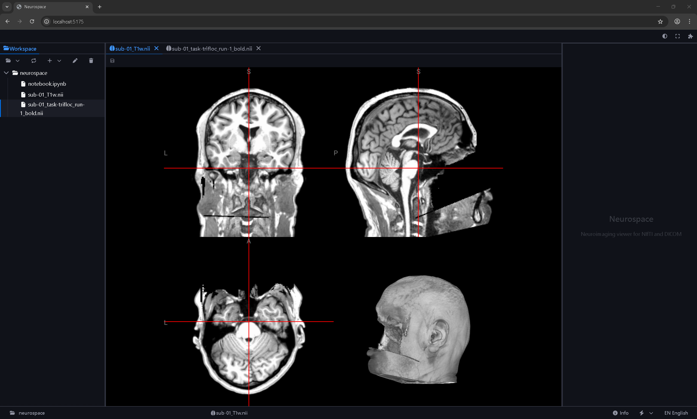
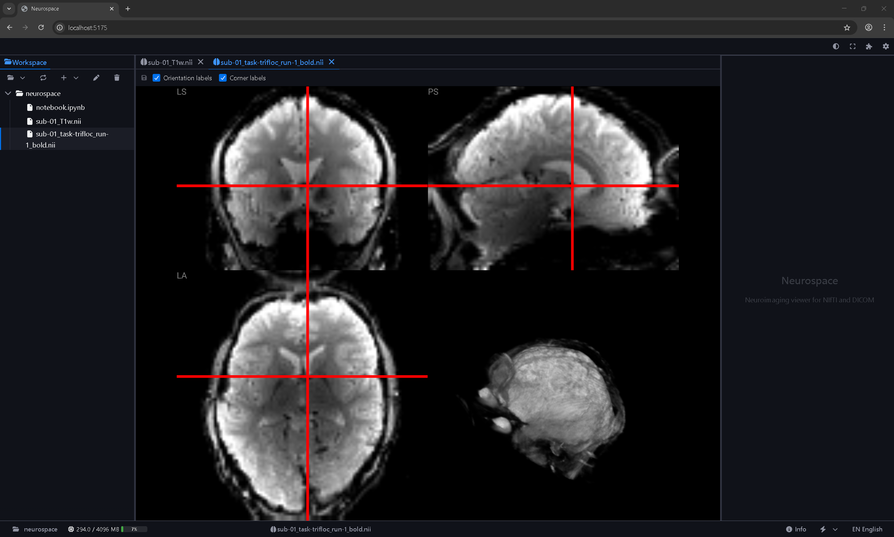
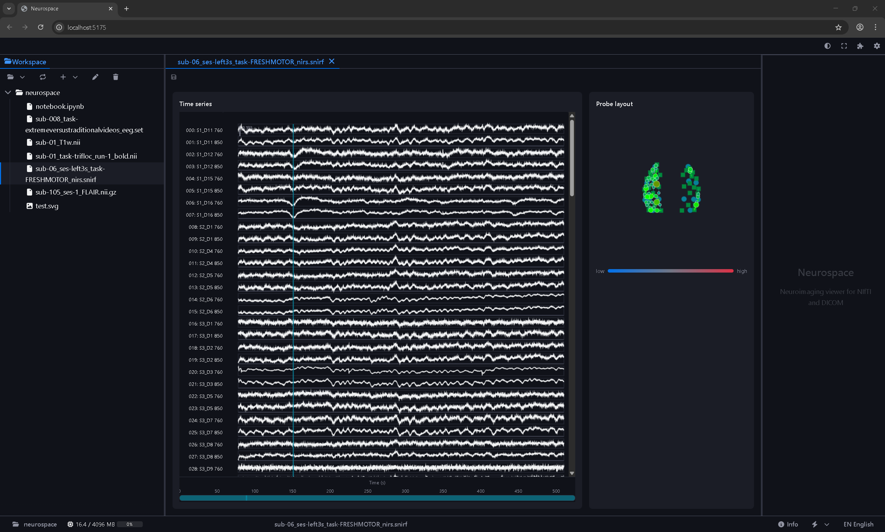

# Neurospace

> **Vision**: Neurospace is evolving toward an application focused on **neuromorphic cognitive modeling**—a unified platform for building, visualizing, and analyzing brain-inspired computational models.

Built on the [Appspace](https://github.com/kispace-io/core) framework, Neurospace currently provides an interactive neuroimaging viewer as its foundation. Over time, it will expand into tools for spiking neural networks, cognitive architectures, and simulation workflows that bridge neuroscience and AI.







## Current Capabilities

- **Neuroimaging viewer**: Displays NIfTI, DICOM, NRRD, and related formats via an editor integrated with the workspace file browser
- **SNIRF viewer**: Displays fNIRS data in SNIRF format (.snirf) with time-series charts and probe layout
- **Formats**: Volumes (NIfTI .nii/.nii.gz, DICOM .dcm, NRRD, MGH/MGZ, MRtrix MIF), powered by [NiiVue](https://github.com/niivue/niivue) (WebGL2, TypeScript); fNIRS (SNIRF), powered by [jsfive](https://github.com/usnistgov/jsfive) (HDF5)

## Roadmap

- Neuroimaging visualization (current)
- Neuromorphic model design and simulation
- Cognitive architecture integration
- Data-driven and theory-driven modeling workflows

## Setup

```bash
npm install
npm run dev
```

Open http://localhost:5173, connect a workspace (folder with neuroimaging or fNIRS files), and open a `.nii.gz`, `.dcm`, or `.snirf` file from the file browser.

## Project Structure

- `packages/neurospace-app` – App entrypoint and shell
- `packages/extension-neuro-viewer` – Neuroimaging editor extension (NIfTI, DICOM, etc.)
- `packages/extension-snirf-viewer` – SNIRF/fNIRS viewer extension

## Dependencies

Uses [Appspace](https://github.com/kispace-io/core) packages from the npm registry (`@kispace-io/core`, `@kispace-io/extension-utils`, etc.).

## License

MIT. See [LICENSE](LICENSE) for details.
