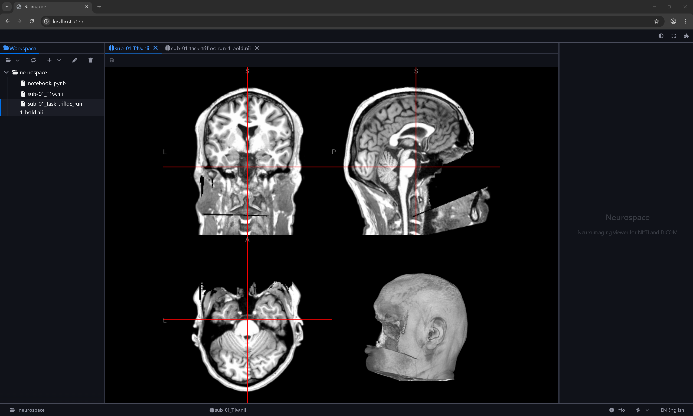
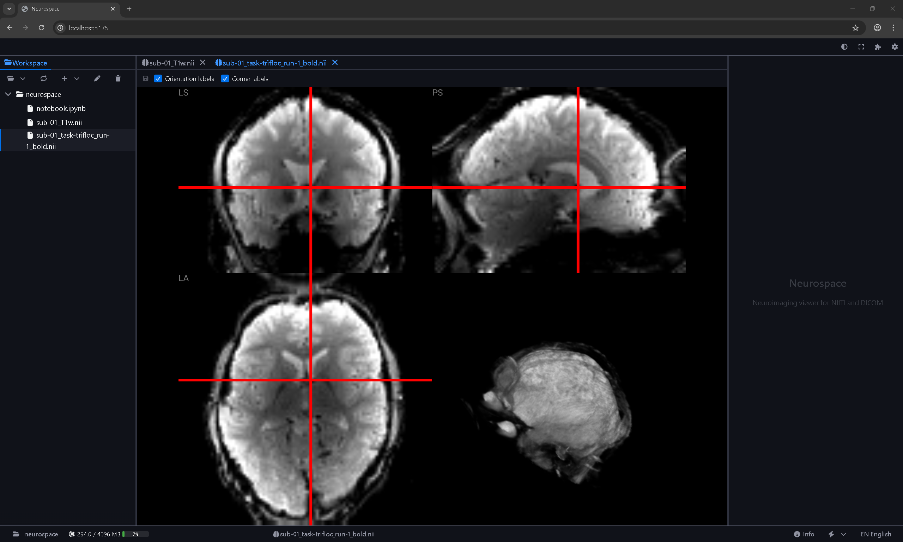
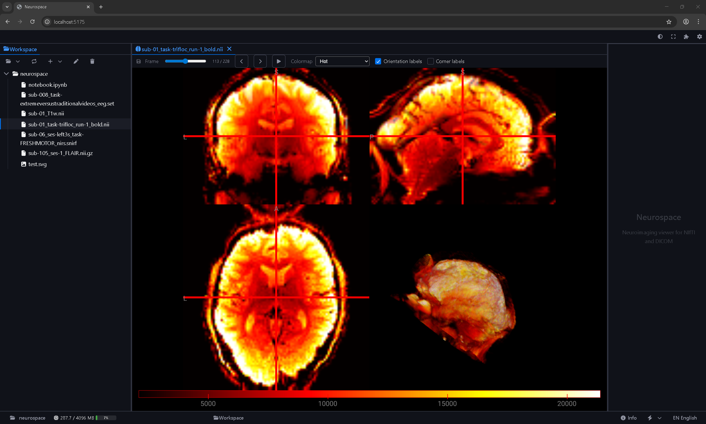
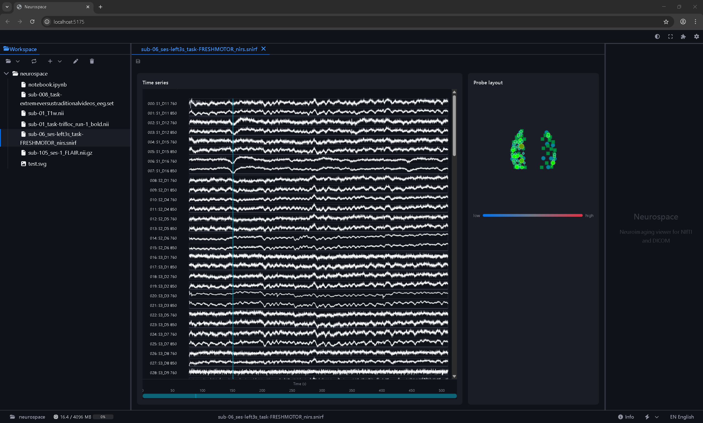
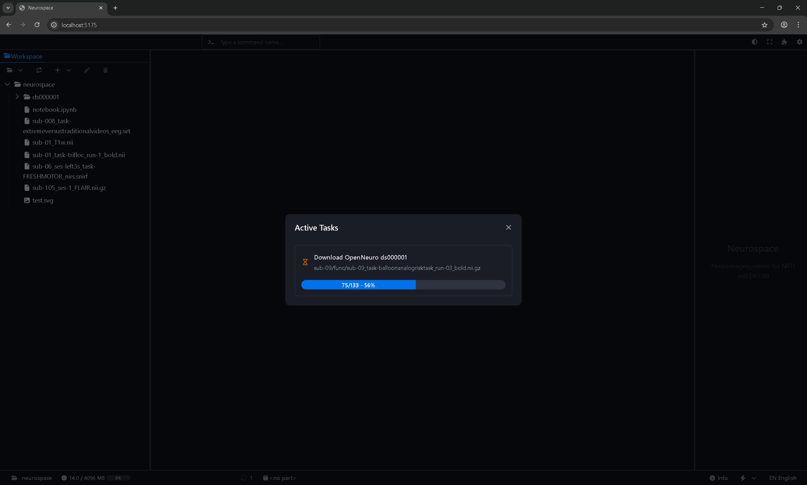

# Neurospace

**Live**: [erdalkaraca.github.io/neurospace](https://erdalkaraca.github.io/neurospace/)

> **Vision**: Neurospace is a **scientific platform for hybrid cognitive architectures**—a unified environment for building, composing, and analyzing models that combine symbolic, connectionist, and neuromorphic approaches.

Built on the [Eclipse Docks](https://github.com/eclipse-docks/core) framework, Neurospace provides neuroimaging visualization and BIDS tooling as a foundation for hybrid cognitive architecture workflows that bridge neuroscience and AI.











## Current Capabilities

- **Neuroimaging viewer**: View NIfTI (.nii/.nii.gz), DICOM (.dcm), NRRD, MGH/MGZ, and MRtrix MIF from the workspace file browser. 4D volumes (e.g. BOLD fMRI) support frame scrubbing, playback, and colormap selection. Powered by [NiiVue](https://github.com/niivue/niivue).
- **SNIRF viewer**: View fNIRS data in SNIRF format (.snirf) with time-series charts and probe layout. Powered by [jsfive](https://github.com/usnistgov/jsfive).
- **OpenNeuro integration**: Browse [OpenNeuro](https://openneuro.org) datasets via lazy-loaded read-only virtual folders—inspect files on demand without downloading gigabytes—or download a full dataset into the workspace.
- **BIDS tooling**: Edit `dataset_description.json` in a JSON editor; validate BIDS datasets and view results in DataView.

## Roadmap

- **Nengo editor**: Edit `.nengo.py` models with in-browser Python, run simulations, and inspect live visualizations (value plots, raster plots, network graph).
- **ACT-R models**: Edit official ACT-R tutorial models (run integration planned).
- **ancpBIDS tooling**: Integrate [ancpBIDS](https://github.com/ANCPLabOldenburg/ancp-bids) for querying, validating, and writing BIDS datasets from the workspace.

## Setup

```bash
npm install
npm run dev
```

Open http://localhost:5173, connect a workspace, and open a supported file (e.g. `.nii.gz`, `.dcm`, or `.snirf`) from the file browser.

## Project Structure

- `packages/app` – App entrypoint and shell
- `packages/extension-neuro-viewer` – Neuroimaging viewer (NIfTI, DICOM, NRRD, MGH/MGZ, MIF)
- `packages/extension-snirf-viewer` – SNIRF/fNIRS viewer
- `packages/extension-nengo-gui` – Nengo model editor and visualizations
- `packages/extension-actr` – ACT-R tutorial models and editor
- `packages/extension-openneuro` – OpenNeuro browse and download
- `packages/extension-bids-editor` – BIDS `dataset_description.json` editor
- `packages/extension-bids-validator` – BIDS validation with DataView results

## Dependencies

Uses [Eclipse Docks](https://github.com/eclipse-docks/core) packages from the npm registry (`@eclipse-docks/core`, `@eclipse-docks/extension-utils`, etc.).

## License

MIT. See [LICENSE](LICENSE) for details.
